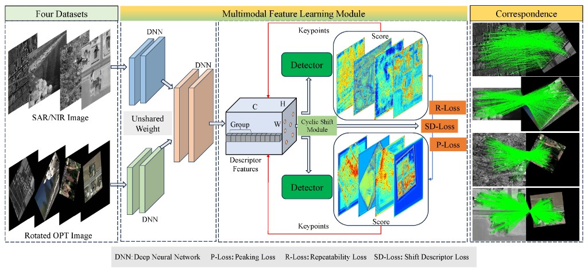
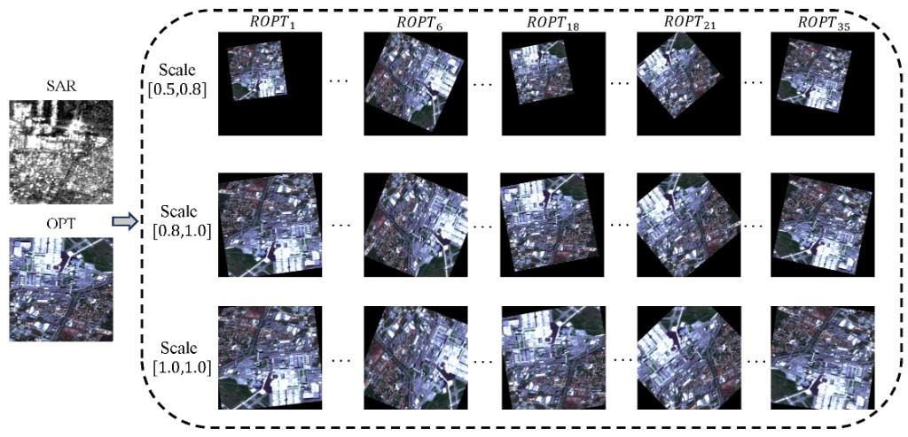
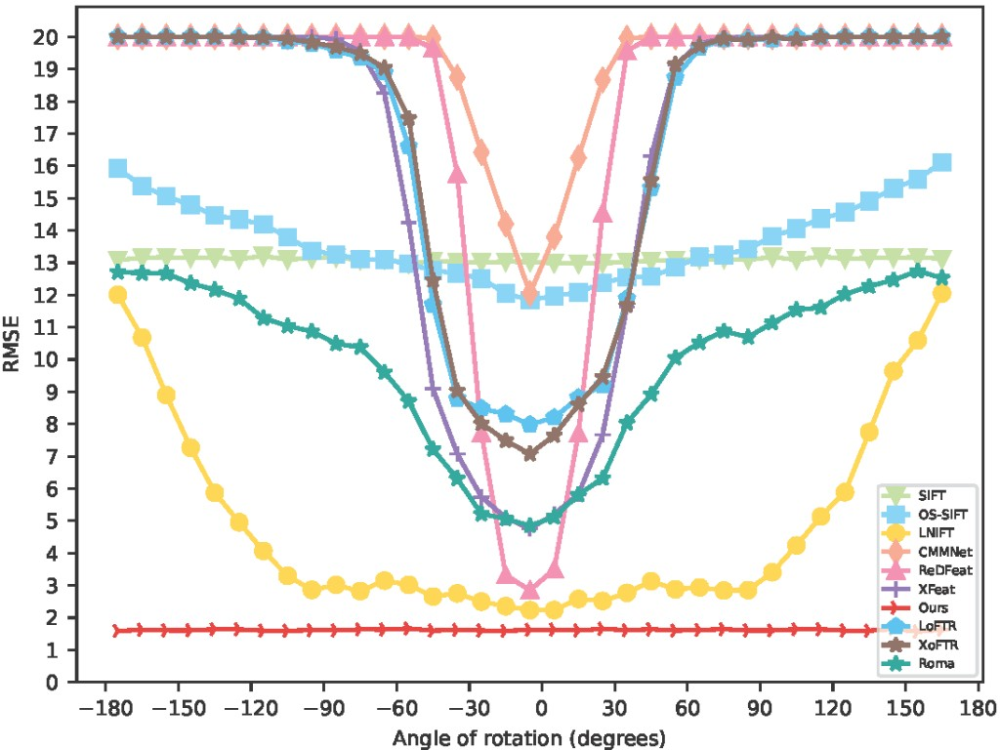
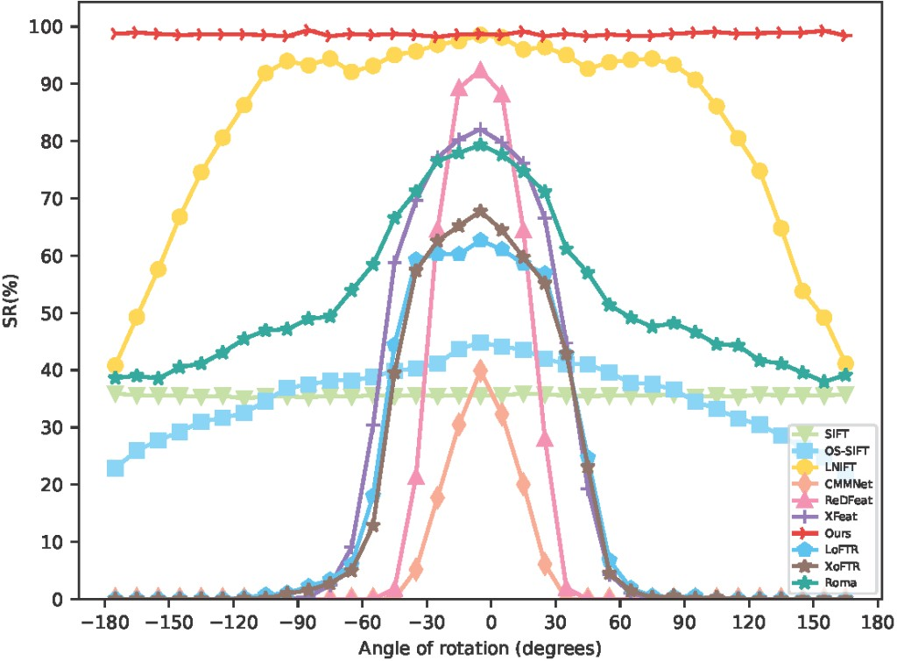
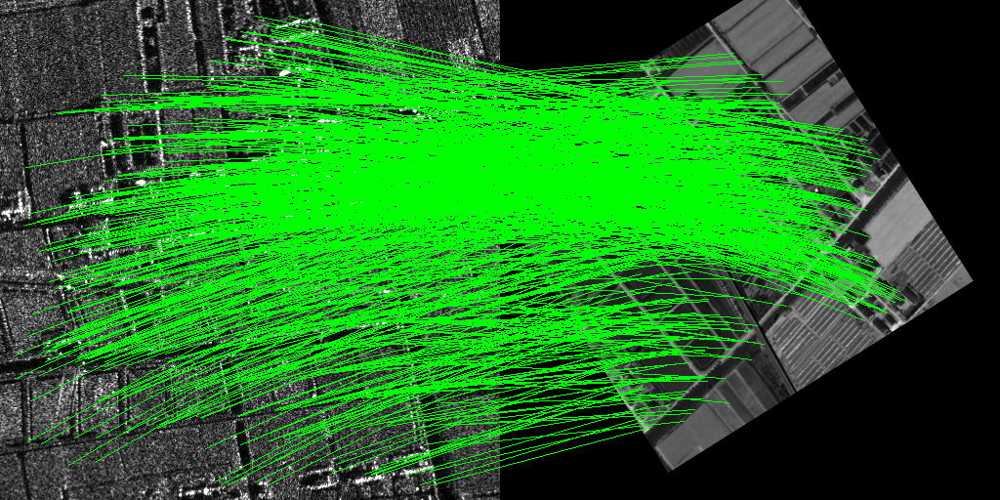
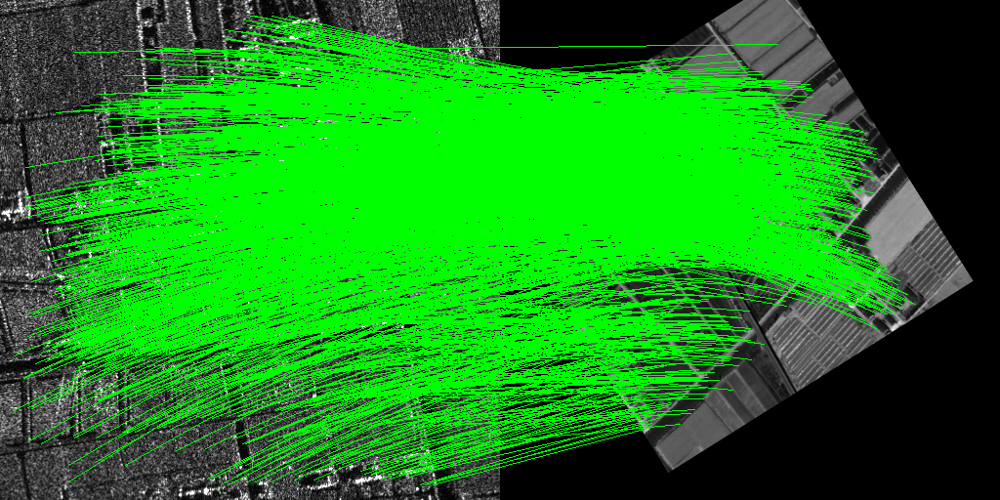

Rotation-Equivariant Framework for End-to-End Multimodal Image Matching



## 📣 News
- **[10/August/2026]** ESWA Accept.
- **[15/Apr/2026]** Release the code and checkpoint, please feel free to contact us if you encounter any problems.
- **[11/Apr/2026]** ESWA Revise
- **[2024]** [Arvix version](https://arxiv.org/abs/2407.11637) is released.

## Abstract

This research focuses on rotation-equivariant multimodal image matching in an end-to-end framework.
The complete release is still in progress because the paper is under revision at *Expert Systems with Applications*.
At this stage, demo code, pretrained weights, and test resources are provided for reproducible inference.

## Preprint

- [https://arxiv.org/abs/2407.11637](https://arxiv.org/abs/2407.11637)

## Test Dataset



- Baidu Pan: [https://pan.baidu.com/s/1IqHwWPJ17PZPuPR8NEvwnQ?pwd=REMM](https://pan.baidu.com/s/1IqHwWPJ17PZPuPR8NEvwnQ?pwd=REMM)
- Extraction code: `REMM`


## Reproduced Results (SAR2)

### Quantitative Setting

```powershell
python demo.py --model-path Pretrained/SAR2/50.pt --img1 data/SAR2/opt_10_0_11.png --img2 data/SAR2/sar_10_0_11.png --homography-file data/SAR2/gt_10_0_11.txt --num-features 5000 --output-prefix R1
python demo.py --model-path Pretrained/SAR2/50.pt --img1 data/SAR2/opt_10_0_11.png --img2 data/SAR2/sar_10_0_11.png --homography-file data/SAR2/gt_10_0_11.txt --num-features 10000 --output-prefix R2
```

### Reported Metrics

- `R1` (`--num-features 5000`): `rmse: 1.9049, NCM: 836`
- `R2` (`--num-features 10000`): `rmse: 1.8896, NCM: 1675`

### Results

| RMSE vs. rotation angle | Success rate (SR) vs. rotation angle |
| ----------------------- | ----------------------------------- |
|  |                  |

### Visual Results


| R1 (5000 features)     | R2 (10000 features)    |
|------------------------|------------------------|
|  |  |


## Installation and Environment Setup

```powershell
pip install torch torchvision pillow opencv-python matplotlib numpy
```

## Demo Quick Start

```powershell
python demo.py
```

Default assets used by `demo.py`:

- Model: `Pretrained/SAR2/50.pt`
- Images: `data/SAR2/opt_10_0_11.png`, `data/SAR2/sar_10_0_11.png`
- Homography: `data/SAR2/gt_10_0_11.txt`

Expected terminal output format:

```text
rmse: <float>, NCM: <int>
```

## Acknowledgement

We sincerely thank the open-source project ReDFeat for its excellent work and valuable inspiration:

- [https://github.com/ACuOoOoO/ReDFeat](https://github.com/ACuOoOoO/ReDFeat)
